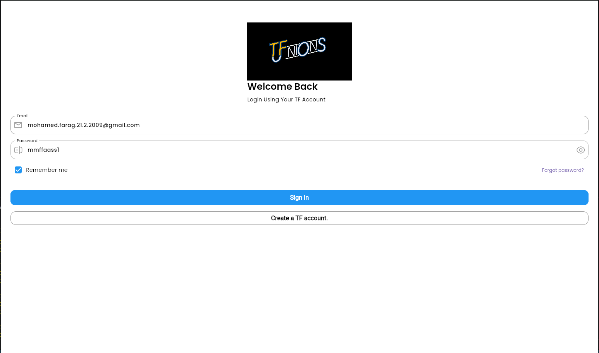
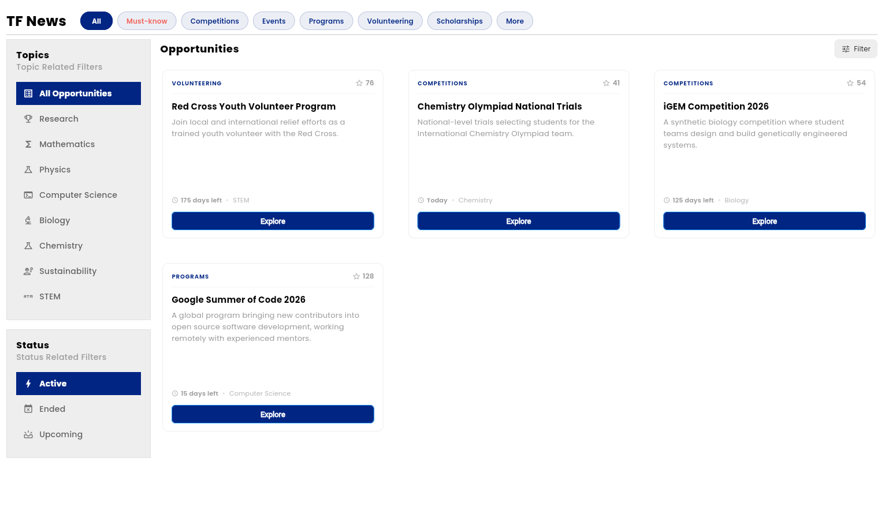
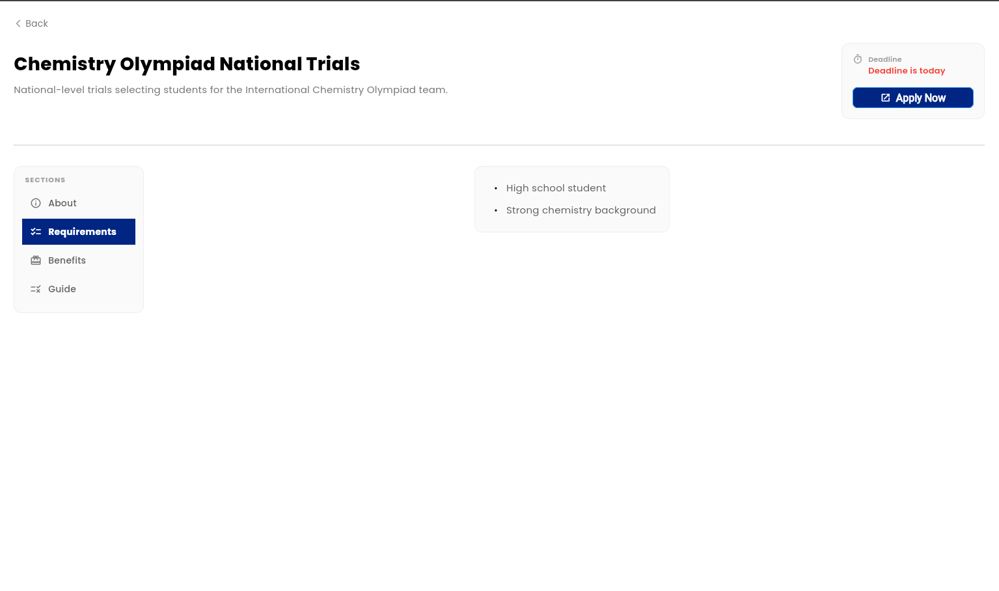
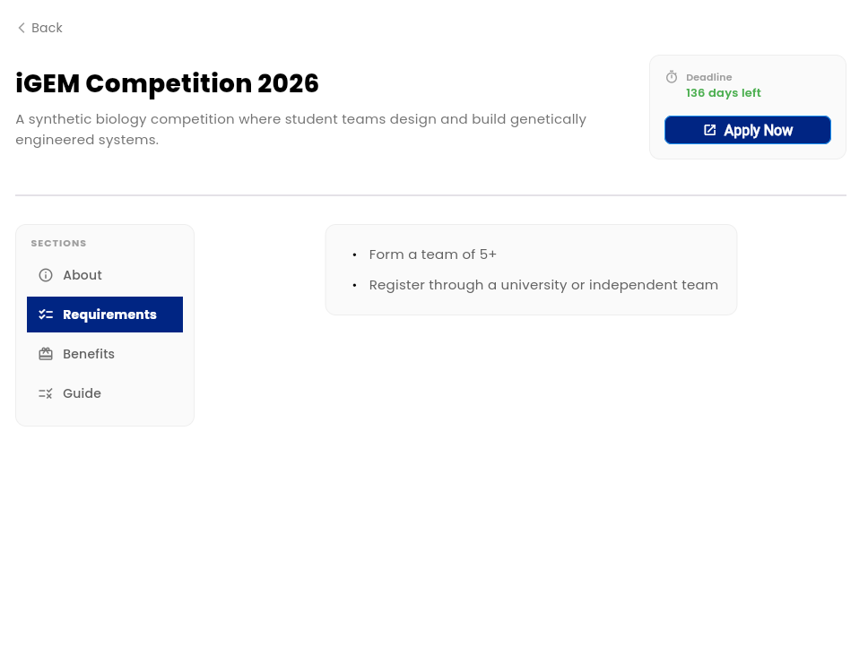

# TF-News

TF-News is a project that I made to help ambitious students like STEM students and standout student in Egypt to find the suitable opportunities faster. I made it using flutter and firebase.

--

## Tester Account

**Email:** mohamed.farag.21.2.2009@gmail.com  
**Password:** mmffaass1

## How to use it 

- Login with your TF-Account or the tester account above

- Browse and filter opportunities from the home page  

- Vote on opportunities you find valuable
- Open any opportunity to explore full details  
!
- Use the left panel to switch between About, Requirements, Benefits, and Guide  

- All content is rendered in Markdown for flexible formatting

## Tech Stack

- Framework | Flutter
- Database | Firebase Firestore
- Authentication | Firebase Auth

## Key Packages

| Package | Purpose |
| --- | --- |
| `get` ^4.7.3 | State management, navigation, DI |
| `firebase_auth` ^6.5.4 | Authentication |
| `cloud_firestore` ^6.6.0 | Database |
| `google_sign_in` ^7.2.0 | Google OAuth |
| `flutter_markdown` ^0.7.7 | Opportunity content rendering |
| `cached_network_image` ^3.4.1 | Efficient image loading |
| `connectivity_plus` ^7.2.0 | Network state detection |
| `shimmer` ^3.0.0 | Loading skeletons |