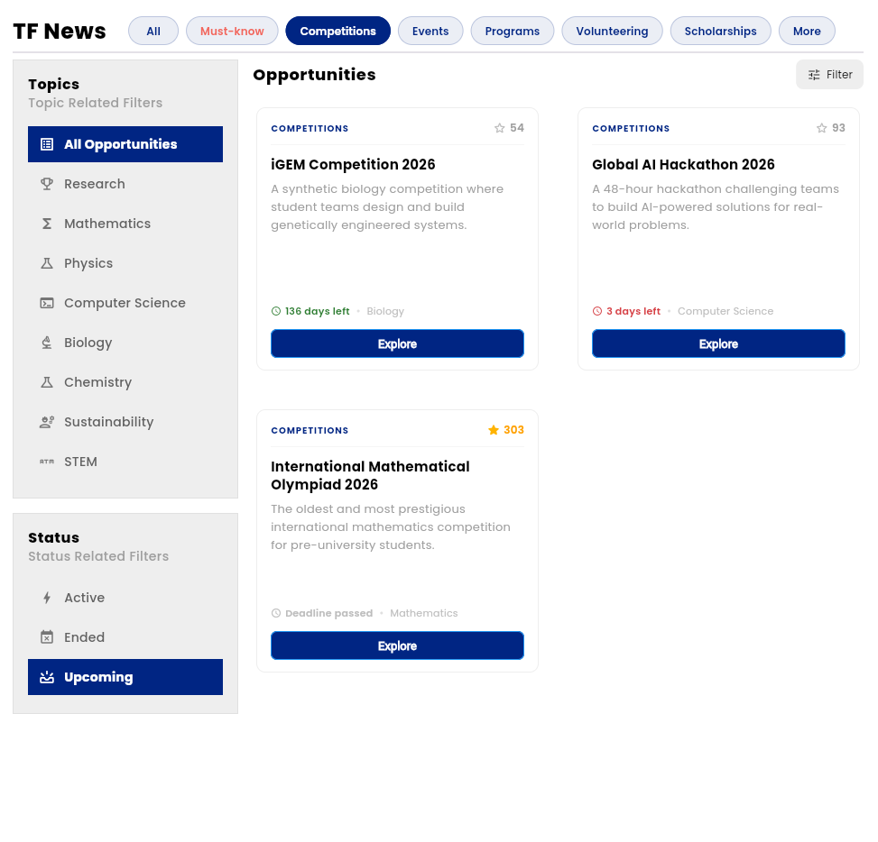

# TF-News

> Built to help ambitious students find their best opportunities faster.

Part of the **TF Unions** platform — connected to a live Firebase database with opportunities across Competitions, Events, Programs, Volunteering, Scholarships, and more. Each category can be filtered by topic (Research, Mathematics, Physics, Computer Science, Biology, Chemistry, Sustainability, STEM) and status (Active, Upcoming, Ended).

---

## Try it out

**Email:** mohamed.farag.21.2.2009@gmail.com  
**Password:** mmffaass1

---

## How it works

- Login with your TF-Account or the test account above
- Browse and filter opportunities from the home page  

- Vote on opportunities you find valuable
- Open any opportunity to explore full details  

- Use the left panel to switch between About, Requirements, Benefits, and Guide  

- All content is rendered in Markdown for flexible formatting

---

## Tech Stack

| Layer | Technology |
| --- | --- |
| Framework | Flutter (Web) |
| State Management | GetX |
| Database | Firebase Firestore |
| Authentication | Firebase Auth + Google Sign-In |
| Image Storage | Cloudinary |

---

## Get Started

```bash
git clone https://github.com/your-username/tf-news
cd tf-news
flutter pub get
flutter run -d chrome
```

> Requires Flutter 3.12+ and a configured `firebase_options.dart`. The app is built for Flutter Web.

---

## Key Packages

| Package | Purpose |
| --- | --- |
| `get` ^4.7.3 | State management, navigation, DI |
| `firebase_auth` ^6.5.4 | Authentication |
| `cloud_firestore` ^6.6.0 | Database |
| `google_sign_in` ^7.2.0 | Google OAuth |
| `flutter_markdown` ^0.7.7 | Opportunity content rendering |
| `cached_network_image` ^3.4.1 | Efficient image loading |
| `connectivity_plus` ^7.2.0 | Network state detection |
| `shimmer` ^3.0.0 | Loading skeletons |